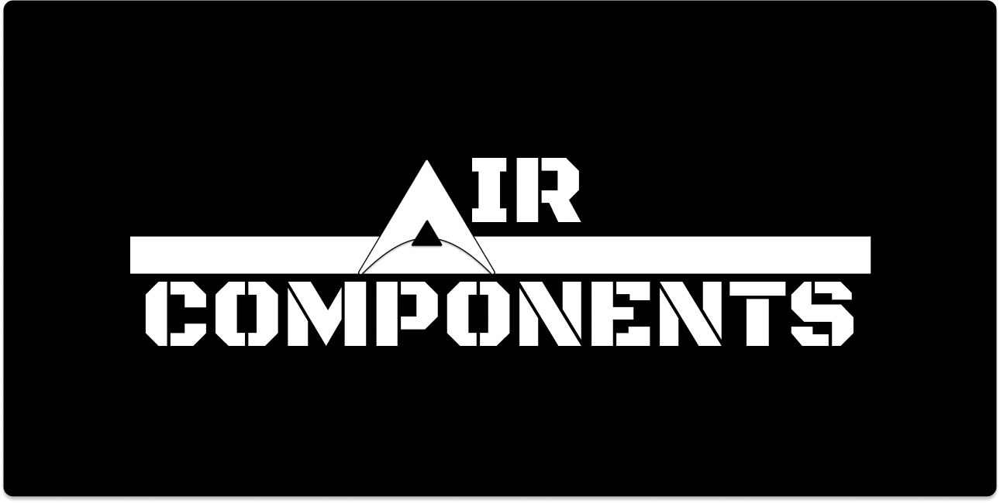

# In Early Development Version, Currently Unavailable



[中文](https://github.com/SisyphusZheng/Components/blob/main/README_CN.md) 
[](https://www.npmjs.com/package/air-components) 
[](https://www.npmjs.com/package/air-components) 
[](https://github.com/aircomponents/Components/blob/main/LICENSE)  
[](https://github.com/aircomponents/Components/commits/main) 
[](https://github.com/aircomponents/Components/network/updates)

## Project Highlights

- **Modular Architecture**: Focused on creating reusable and flexible components.

- **Modern Design Principles**: Emphasizes minimalist UI design with support for multiple themes and visual styles.
- **Customizable Components**: Easily adapt component styles to meet project-specific requirements using standard CSS.

---

## Installation

Install Air-Components using npm:

```bash
npm install @airdesign/ui
```

### CDN

```html
  <title>Test AirComponents</title>
  <script type="module" src="https://unpkg.com/@aircomponents/ui@0.0.7/dist/aircomponents/aircomponents.esm.js"></script>
</head>
<body>
  <air-button size="medium" variant="solid" color="primary">Primary Button</air-button>
  <air-button size="medium" variant="outline" color="primary">Outline Primary</air-button>
</body>
</html>
```

```JS
import '@aircomponents/ui';

document.body.innerHTML = `
  <air-button size="medium" variant="solid" color="primary">Primary Button</air-button>
`;
```

## Development Notes

### This project is in early development; features and components are actively being built

### Contributions and feedback are welcome. Visit our GitHub repository for more information
