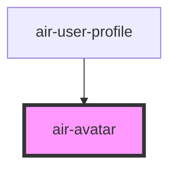

# air-avatar

<!-- Auto Generated Below -->

## Properties

| Property | Attribute | Description                                        | Type                   | Default    |
| -------- | --------- | -------------------------------------------------- | ---------------------- | ---------- |
| `border` | `border`  | 边框样式，可自定义。                                         | `string`               | `''`       |
| `name`   | `name`    | 用户姓名，用于生成首字母缩写。                                    | `string`               | `''`       |
| `shape`  | `shape`   | 头像形状，支持 'circle' 或 'square'。                       | `"circle" \| "square"` | `'circle'` |
| `size`   | `size`    | 头像尺寸，支持 `small`、`medium`、`large` 或自定义值（例如：`5rem`）。 | `string`               | `'medium'` |
| `src`    | `src`     | 用户头像图片的 URL 地址。                                    | `string`               | `''`       |

## Dependencies

### Used by

 - [air-user-profile](../user-profile)

### Graph

----------------------------------------------

*Built with [StencilJS](https://stenciljs.com/)*
