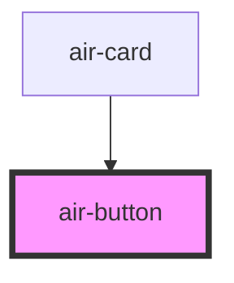

# air-button

<!-- Auto Generated Below -->

## Properties

| Property     | Attribute     | Description | Type                                                              | Default    |
| ------------ | ------------- | ----------- | ----------------------------------------------------------------- | ---------- |
| `autoWidth`  | `auto-width`  |             | `boolean`                                                         | `false`    |
| `circle`     | `circle`      |             | `boolean`                                                         | `false`    |
| `content`    | `content`     |             | `string`                                                          | `''`       |
| `disabled`   | `disabled`    |             | `boolean`                                                         | `false`    |
| `ghost`      | `ghost`       |             | `boolean`                                                         | `false`    |
| `icon`       | `icon`        |             | `string`                                                          | `''`       |
| `loading`    | `loading`     |             | `boolean`                                                         | `false`    |
| `plain`      | `plain`       |             | `boolean`                                                         | `false`    |
| `round`      | `round`       |             | `boolean`                                                         | `false`    |
| `size`       | `size`        |             | `"big" \| "medium" \| "small"`                                    | `'medium'` |
| `suffixIcon` | `suffix-icon` |             | `string`                                                          | `''`       |
| `type`       | `type`        |             | `"" \| "danger" \| "info" \| "primary" \| "success" \| "warning"` | `''`       |

## Dependencies

### Used by

 - [air-card](../card)

### Graph

----------------------------------------------

*Built with [StencilJS](https://stenciljs.com/)*
