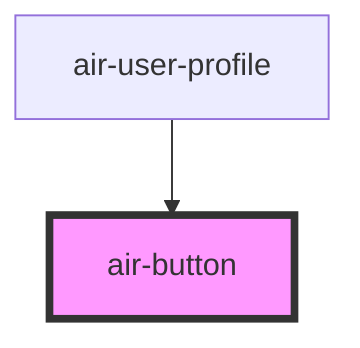

# air-button

<!-- Auto Generated Below -->

## Properties

| Property     | Attribute     | Description | Type                                                                                | Default     |
| ------------ | ------------- | ----------- | ----------------------------------------------------------------------------------- | ----------- |
| `color`      | `color`       |             | `"danger" \| "default" \| "ghost" \| "info" \| "primary" \| "success" \| "warning"` | `"default"` |
| `disabled`   | `disabled`    |             | `boolean`                                                                           | `false`     |
| `icon`       | `icon`        |             | `string`                                                                            | `""`        |
| `loading`    | `loading`     |             | `boolean`                                                                           | `false`     |
| `selected`   | `selected`    |             | `boolean`                                                                           | `false`     |
| `size`       | `size`        |             | `"large" \| "medium" \| "small"`                                                    | `"medium"`  |
| `suffixIcon` | `suffix-icon` |             | `string`                                                                            | `""`        |
| `variant`    | `variant`     |             | `"default" \| "neo" \| "outline" \| "solid" \| "text"`                              | `"default"` |

## Events

| Event         | Description | Type                                                     |
| ------------- | ----------- | -------------------------------------------------------- |
| `buttonClick` |             | `CustomEvent<{ event: MouseEvent; selected: boolean; }>` |

## Dependencies

### Used by

 - [air-user-profile](../user-profile)

### Graph

----------------------------------------------

*Built with [StencilJS](https://stenciljs.com/)*
