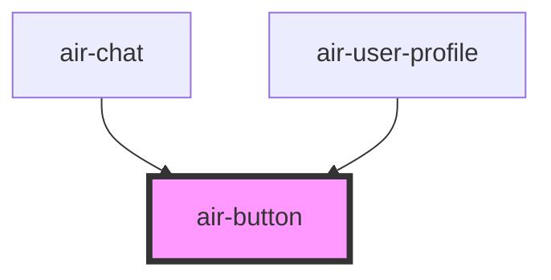

# air-button

<!-- Auto Generated Below -->

## Properties

| Property     | Attribute     | Description | Type                                                                                           | Default     |
| ------------ | ------------- | ----------- | ---------------------------------------------------------------------------------------------- | ----------- |
| `disabled`   | `disabled`    |             | `boolean`                                                                                      | `false`     |
| `icon`       | `icon`        |             | `string`                                                                                       | `''`        |
| `loading`    | `loading`     |             | `boolean`                                                                                      | `false`     |
| `selected`   | `selected`    |             | `boolean`                                                                                      | `false`     |
| `size`       | `size`        |             | `"large" \| "medium" \| "small"`                                                               | `'medium'`  |
| `state`      | `state`       |             | `"danger" \| "ghost" \| "info" \| "outline" \| "primary" \| "solid" \| "success" \| "warning"` | `'primary'` |
| `suffixIcon` | `suffix-icon` |             | `string`                                                                                       | `''`        |
| `type`       | `type`        |             | `"button" \| "reset" \| "submit"`                                                              | `'button'`  |

## Events

| Event         | Description | Type                                                     |
| ------------- | ----------- | -------------------------------------------------------- |
| `buttonClick` |             | `CustomEvent<{ event: MouseEvent; selected: boolean; }>` |

## Dependencies

### Used by

 - [air-chat](../chat)
 - [air-user-profile](../user-profile)

### Graph

----------------------------------------------

*Built with [StencilJS](https://stenciljs.com/)*
