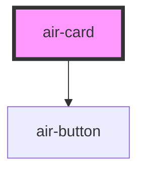

# demo-card

<!-- Auto Generated Below -->

## Properties

| Property      | Attribute      | Description | Type      | Default     |
| ------------- | -------------- | ----------- | --------- | ----------- |
| `cardContent` | `card-content` |             | `string`  | `undefined` |
| `cardTitle`   | `card-title`   |             | `string`  | `undefined` |
| `padding`     | `padding`      |             | `string`  | `'p-6'`     |
| `rounded`     | `rounded`      |             | `boolean` | `true`      |
| `shadow`      | `shadow`       |             | `boolean` | `true`      |
| `showButton`  | `show-button`  |             | `boolean` | `false`     |
| `width`       | `width`        |             | `string`  | `''`        |

## Dependencies

### Depends on

- [air-button](../button)

### Graph

----------------------------------------------

*Built with [StencilJS](https://stenciljs.com/)*
