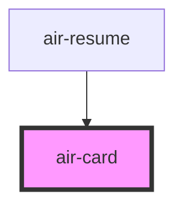

# air-card

<!-- Auto Generated Below -->

## Properties

| Property        | Attribute        | Description | Type                                       | Default                       |
| --------------- | ---------------- | ----------- | ------------------------------------------ | ----------------------------- |
| `cardTitle`     | `card-title`     |             | `string`                                   | `'Card Title'`                |
| `center`        | `center`         |             | `boolean`                                  | `false`                       |
| `content`       | `content`        |             | `string`                                   | `'This is the card content.'` |
| `imageUrl`      | `image-url`      |             | `string`                                   | `''`                          |
| `isHighlighted` | `is-highlighted` |             | `boolean`                                  | `false`                       |
| `size`          | `size`           |             | `"auto" \| "large" \| "medium" \| "small"` | `'medium'`                    |

## Events

| Event         | Description | Type                |
| ------------- | ----------- | ------------------- |
| `cardClicked` |             | `CustomEvent<void>` |

## Dependencies

### Used by

 - [air-resume](../resume)

### Graph

----------------------------------------------

*Built with [StencilJS](https://stenciljs.com/)*
