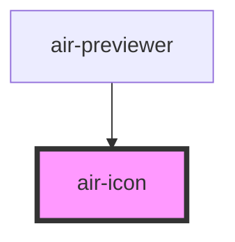

# air-icon

<!-- Auto Generated Below -->

## Properties

| Property  | Attribute  | Description | Type                                                                     | Default            |
| --------- | ---------- | ----------- | ------------------------------------------------------------------------ | ------------------ |
| `color`   | `color`    |             | `string`                                                                 | `'currentColor'`   |
| `iconSet` | `icon-set` |             | `"bx" \| "bxs" \| "fas" \| "iconfont" \| "iconpark" \| "material-icons"` | `'material-icons'` |
| `name`    | `name`     |             | `string`                                                                 | `undefined`        |
| `size`    | `size`     |             | `string`                                                                 | `'1.5em'`          |

## Dependencies

### Used by

 - [air-previewer](../previwer)

### Graph

----------------------------------------------

*Built with [StencilJS](https://stenciljs.com/)*
