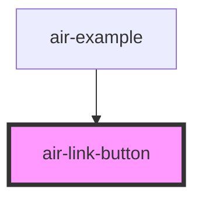

# air-link-button

<!-- Auto Generated Below -->

## Properties

| Property    | Attribute    | Description | Type     | Default        |
| ----------- | ------------ | ----------- | -------- | -------------- |
| `href`      | `href`       |             | `string` | `undefined`    |
| `icon`      | `icon`       |             | `string` | `undefined`    |
| `label`     | `label`      |             | `string` | `undefined`    |
| `textColor` | `text-color` |             | `string` | `"text-black"` |

## Dependencies

### Used by

 - [air-example](../example)

### Graph

----------------------------------------------

*Built with [StencilJS](https://stenciljs.com/)*
