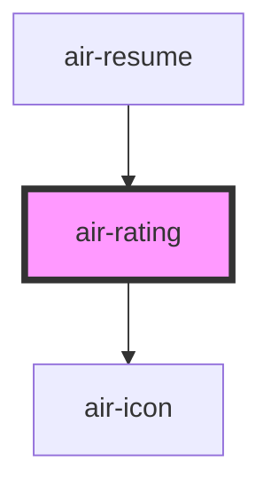

# air-rating

<!-- Auto Generated Below -->

## Properties

| Property      | Attribute     | Description             | Type                                                                     | Default            |
| ------------- | ------------- | ----------------------- | ------------------------------------------------------------------------ | ------------------ |
| `customStyle` | --            | 自定义样式（CSS键值对对象）         | `{ [key: string]: string; }`                                             | `{}`               |
| `emptyIcon`   | `empty-icon`  | 未选中图标                   | `string`                                                                 | `'star-outline'`   |
| `filledIcon`  | `filled-icon` | 选中图标（直接使用air-icon的name） | `string`                                                                 | `'star'`           |
| `iconSet`     | `icon-set`    |                         | `"bx" \| "bxs" \| "fas" \| "iconfont" \| "iconpark" \| "material-icons"` | `'material-icons'` |
| `level`       | `level`       | 当前评分等级 (0~max)          | `number`                                                                 | `0`                |
| `max`         | `max`         | 最大星数（1-10）              | `number`                                                                 | `5`                |

## Events

| Event          | Description | Type                  |
| -------------- | ----------- | --------------------- |
| `ratingChange` | 评分变化事件      | `CustomEvent<number>` |

## Dependencies

### Used by

 - [air-resume](../resume)

### Depends on

- [air-icon](../icon)

### Graph

----------------------------------------------

*Built with [StencilJS](https://stenciljs.com/)*
