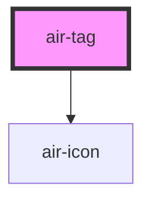

# air-tag

<!-- Auto Generated Below -->

## Properties

| Property   | Attribute  | Description | Type                                               | Default  |
| ---------- | ---------- | ----------- | -------------------------------------------------- | -------- |
| `closable` | `closable` |             | `boolean`                                          | `false`  |
| `color`    | `color`    |             | `"blue" \| "gray" \| "green" \| "red" \| "yellow"` | `'gray'` |
| `rounded`  | `rounded`  |             | `"full" \| "md" \| "none"`                         | `'md'`   |
| `size`     | `size`     |             | `"md" \| "sm"`                                     | `'md'`   |

## Events

| Event      | Description | Type                |
| ---------- | ----------- | ------------------- |
| `airClose` |             | `CustomEvent<void>` |

## Shadow Parts

| Part             | Description |
| ---------------- | ----------- |
| `"close-button"` |             |

## Dependencies

### Depends on

- [air-icon](../icon)

### Graph

----------------------------------------------

*Built with [StencilJS](https://stenciljs.com/)*
