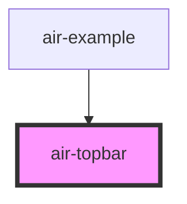

# top-nav-bar

<!-- Auto Generated Below -->

## Properties

| Property            | Attribute             | Description | Type      | Default                                                       |
| ------------------- | --------------------- | ----------- | --------- | ------------------------------------------------------------- |
| `defaultBgColor`    | `default-bg-color`    |             | `string`  | `''`                                                          |
| `gradientBgColor`   | `gradient-bg-color`   |             | `string`  | `'bg-gradient-to-r from-purple-500 via-blue-500 to-teal-500'` |
| `scrollBgColor`     | `scroll-bg-color`     |             | `string`  | `'bg-transparent'`                                            |
| `scrolledTextColor` | `scrolled-text-color` |             | `string`  | `'text-gray-900'`                                             |
| `shadowEffect`      | `shadow-effect`       |             | `boolean` | `true`                                                        |
| `textColor`         | `text-color`          |             | `string`  | `'text-black'`                                                |
| `titleText`         | `title-text`          |             | `string`  | `'AirComponents'`                                             |
| `titleTextColor`    | `title-text-color`    |             | `string`  | `'text-black-500'`                                            |

## Dependencies

### Used by

 - [air-example](../example)

### Graph

----------------------------------------------

*Built with [StencilJS](https://stenciljs.com/)*
