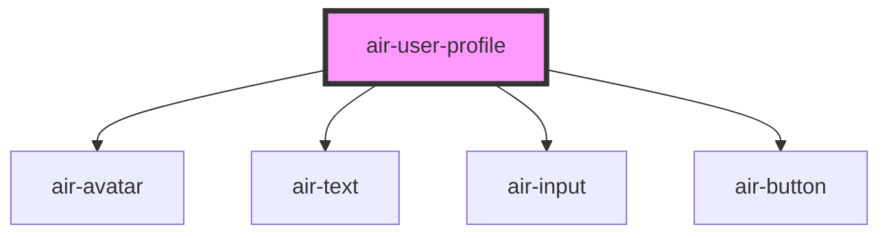

# air-user-profile

<!-- Auto Generated Below -->

## Properties

| Property    | Attribute    | Description | Type      | Default     |
| ----------- | ------------ | ----------- | --------- | ----------- |
| `avatarSrc` | `avatar-src` |             | `string`  | `undefined` |
| `editable`  | `editable`   |             | `boolean` | `false`     |
| `userBio`   | `user-bio`   |             | `string`  | `undefined` |
| `userName`  | `user-name`  |             | `string`  | `undefined` |

## Dependencies

### Depends on

- [air-avatar](../avatar)
- [air-text](../text)
- [air-input](../input)
- [air-button](../button)

### Graph

----------------------------------------------

*Built with [StencilJS](https://stenciljs.com/)*
